# Flow Diagrams - Adapt Accuracy Analysis

## 🔄 System Flow Overview

This document provides visual representations of the data flow and process diagrams for the Adapt Accuracy Analysis system.

---

## 📊 Overall System Architecture

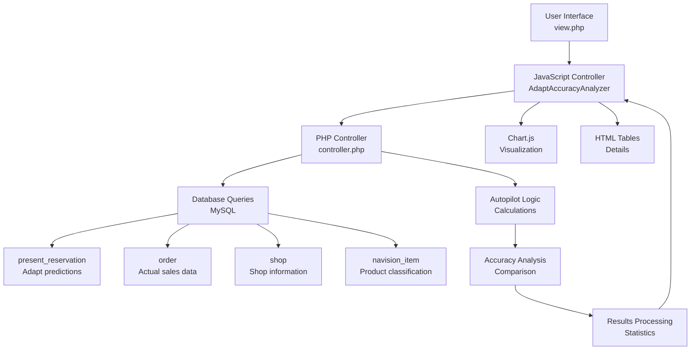

---

## 🎯 Single Shop Analysis Flow

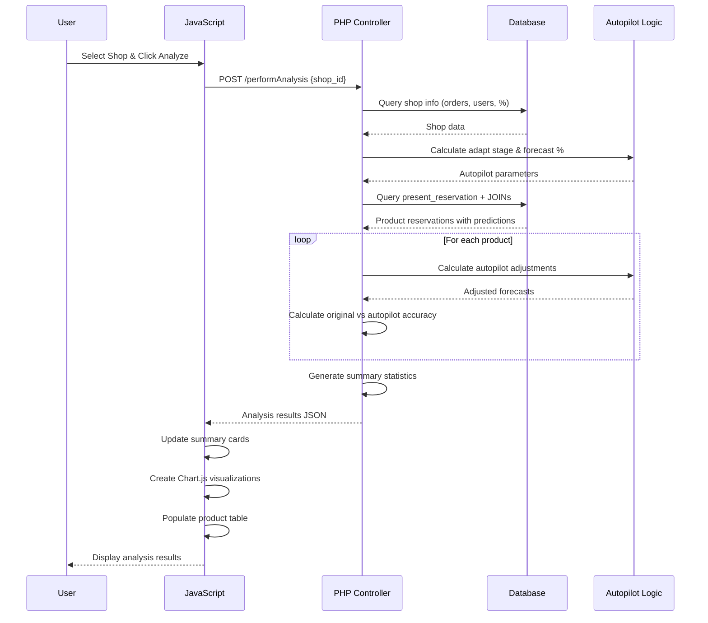

---

## 🤖 Autopilot Logic Flow

```mermaid
flowchart TD
    A[Start: Product Analysis] --> B{External Product?<br/>is_external > 0}
    
    B -->|Yes| C[🛡️ PROTECTED<br/>Return original forecast<br/>Reason: protected_external]
    
    B -->|No| D{Zero Orders?<br/>order_count = 0}
    
    D -->|Yes| E[Calculate Zero Forecast<br/>Based on shop size & % selected]
    E --> F[Apply zero forecast value<br/>5-10 items depending on thresholds]
    
    D -->|No| G[Calculate Adapt Stage<br/>Based on total_orders & procent_selected]
    G --> H[Determine Forecast Multiplier<br/>1.05x - 1.3x based on stage]
    
    H --> I[Apply Standard Adjustment<br/>adjusted = ceil(original × multiplier)]
    
    I --> J{Low Selection?<br/>procent_selected < 27%}
    
    J -->|Yes| K[Apply Low Selection Boost<br/>adjusted = ceil(adjusted × 1.5)]
    J -->|No| L[Final Adjusted Forecast]
    K --> L
    
    C --> M[Return Result]
    F --> M
    L --> M
    
    M --> N[Calculate Accuracy vs Actual Orders]
    N --> O[End: Accuracy Comparison]
```

---

## 📈 Accuracy Calculation Process

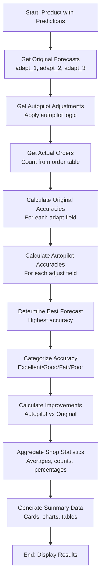

---

## 🔍 Data Query Flow

```mermaid
graph LR
    A[Query Start] --> B[Get Shop Information<br/>total_orders, procent_selected]
    
    B --> C[Main Reservation Query<br/>present_reservation base]
    
    C --> D[LEFT JOIN present_model<br/>Get model names]
    
    D --> E[LEFT JOIN present<br/>Get present names]
    
    E --> F[LEFT JOIN navision_item<br/>Get is_external classification]
    
    F --> G[Subquery: Count Orders<br/>Group by shop_id, present_id, model_id]
    
    G --> H[Filter: order_count >= 5<br/>Only analyze active products]
    
    H --> I[Filter: Has Predictions<br/>adapt_1/2/3 IS NOT NULL]
    
    I --> J[Return Dataset<br/>Ready for analysis]
```

---

## 🏆 Multi-Shop Comparison Flow

### Progressive Comparison (Recommended)

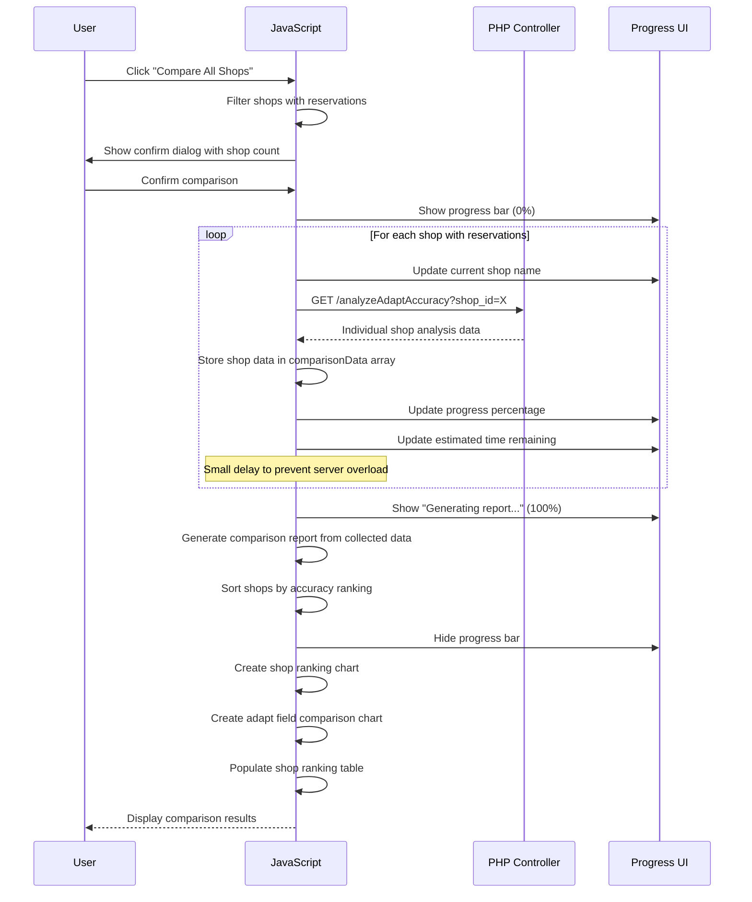

### Legacy Comparison (May Timeout)

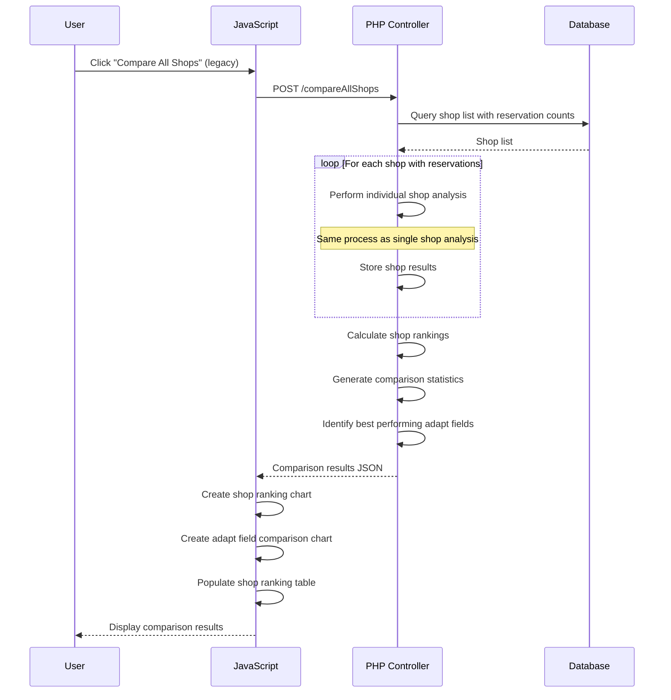

---

## 🎨 Frontend State Management Flow

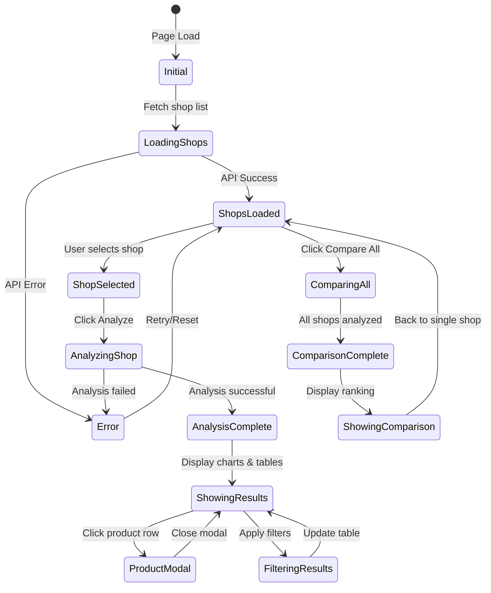

---

## 📊 Chart Creation Process

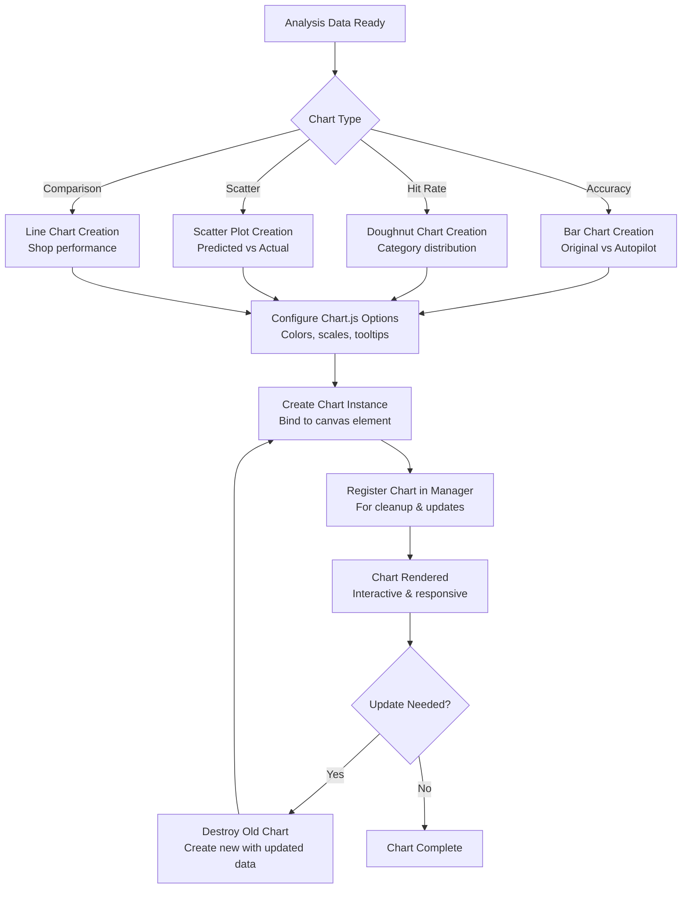

---

## 🔍 Shop Search Flow

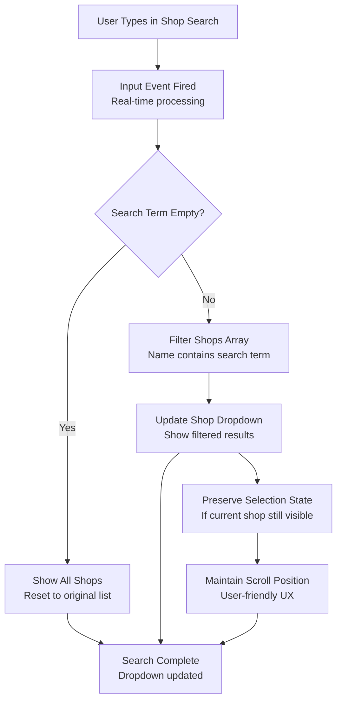

## 🔄 Filter & Search Flow

```mermaid
graph TD
    A[User Input Event<br/>Search/Filter change] --> B[Debounce Timer<br/>300ms delay for search]
    
    B --> C[Get Current Products<br/>From analysis data]
    
    C --> D[Apply Search Filter<br/>Product name contains text]
    
    D --> E[Apply Accuracy Filter<br/>Match category thresholds]
    
    E --> F[Apply Type Filter<br/>Internal/External classification]
    
    F --> G[Apply Status Filter<br/>Active/Closed/Autopilot]
    
    G --> H[Filter Results<br/>Boolean AND logic]
    
    H --> I[Update Product Table<br/>Re-render filtered rows]
    
    I --> J[Update Row Count<br/>Show "X of Y products"]
    
    J --> K[Maintain Sort Order<br/>Preserve existing sort]
    
    K --> L[Re-attach Events<br/>Click handlers for new rows]
    
    L --> M[Filter Complete<br/>Table updated]
```

---

## 🎯 Product Detail Modal Flow

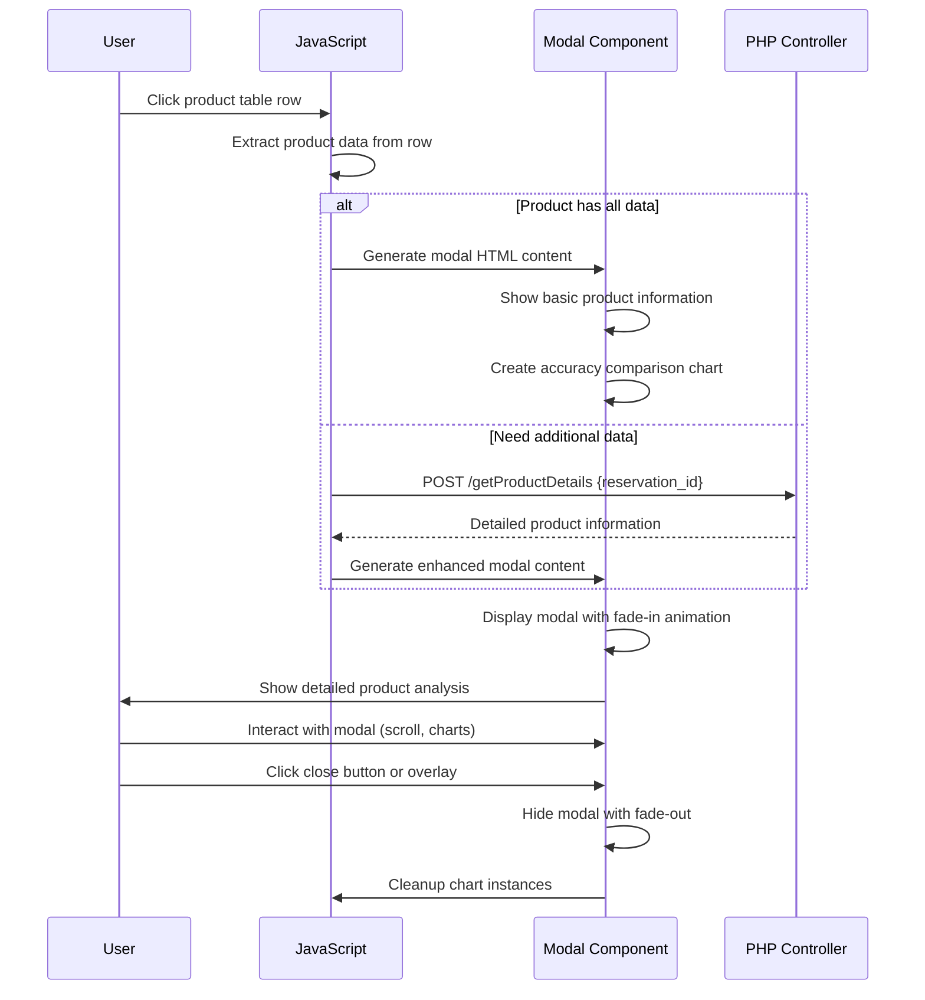

---

## 🎨 Responsive Layout Flow

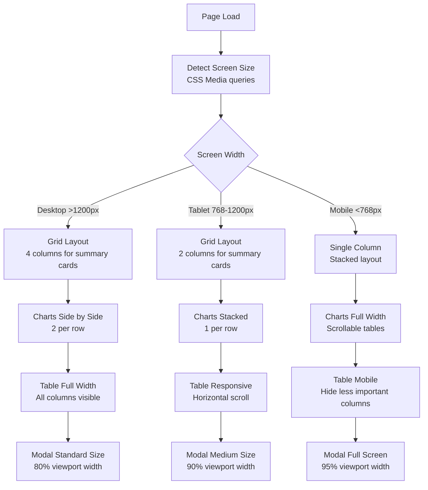

---

## 🚨 Error Handling Flow

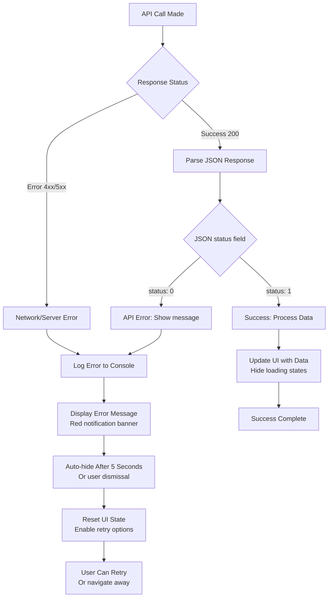

---

## 📊 Progress Bar Flow

```mermaid
graph TD
    A[Start Progressive Analysis] --> B[Show Progress Container<br/>0% initial state]
    
    B --> C[Initialize Progress Tracking<br/>startTime, currentShop, totalShops]
    
    C --> D[For Each Shop Loop<br/>Individual processing]
    
    D --> E[Update Progress Bar<br/>Calculate percentage]
    
    E --> F[Update Progress Text<br/>"X% - Analyserer..."]
    
    F --> G[Update Current Shop Name<br/>Show which shop is processing]
    
    G --> H[Calculate Time Remaining<br/>Based on elapsed time and progress]
    
    H --> I[Update Progress Details<br/>Analyzed count, ETA]
    
    I --> J{More Shops?}
    
    J -->|Yes| D
    J -->|No| K[Final Progress State<br/>100% - "Færdig!"]
    
    K --> L[Hide Progress Bar<br/>Show Results]
    
    L --> M[Progress Complete]
```

## 📈 Performance Optimization Flow

```mermaid
graph LR
    A[Initial Load] --> B[Lazy Load Charts<br/>Only when visible]
    
    B --> C[Debounce Search<br/>300ms delay]
    
    C --> D[Virtual Scrolling<br/>Large product tables]
    
    D --> E[Chart Reuse<br/>Update data vs recreate]
    
    E --> F[Memory Cleanup<br/>Destroy unused charts]
    
    F --> G[Request Caching<br/>Avoid duplicate API calls]
    
    G --> H[Progressive Loading<br/>100ms delays between requests]
    
    H --> I[CSS Animation<br/>Hardware acceleration]
    
    I --> J[Bundle Minification<br/>Smaller file sizes]
    
    J --> K[CDN Resources<br/>Chart.js from CDN]
```

This comprehensive flow documentation provides visual representations of all major processes in the Adapt Accuracy Analysis system, from high-level architecture to detailed component interactions.